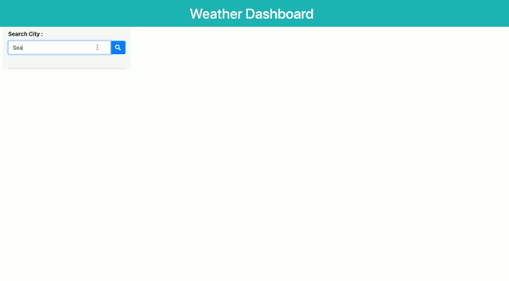
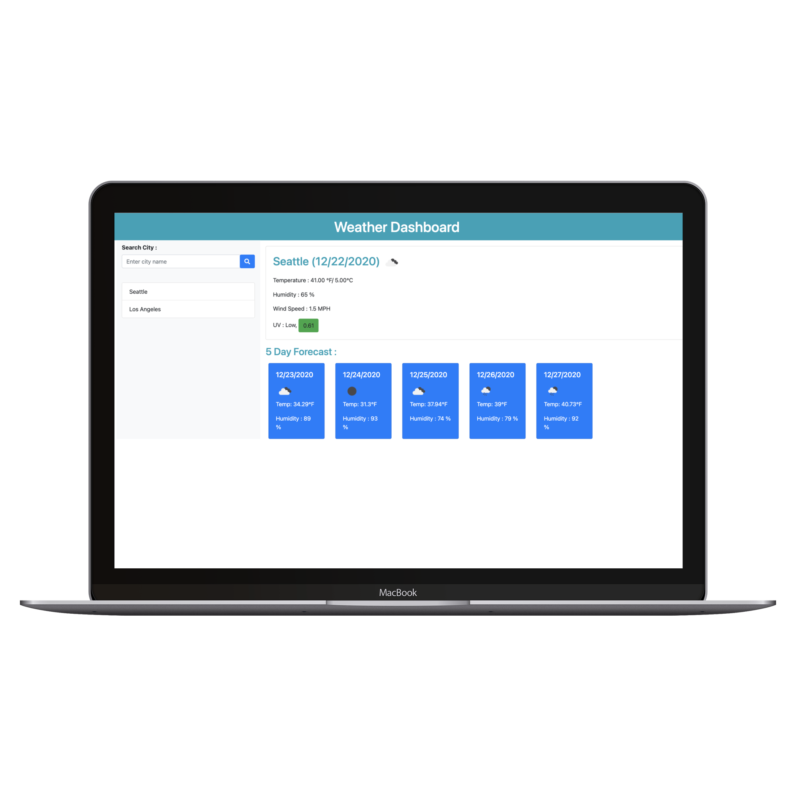

# Weather-Dashboard

# Description : 

This is a weather dashboard application to get current weather conditions of searched city and 5 day forecast of that city. This application is built using *OpenWeather API* to fetch weather data of searched city.

## Deployed Website : 
[Weather Dashboard](https://gaurikhandke.github.io/Gauri-weather-dashboard/)

# Table of Contents
* [Demo](#demo)
* [Technology](#technology)
* [Features](#features)
* [License](#license)
* [Contribution](#contribution)
* [Questions](#questions)

# Motivation : 

Developers are often tasked with retrieving data from another application's API and using it in the context of their own. Third-party APIs allow developers to access their data and functionality by making requests with specific parameters to a URL.

# Demo : 

# Application Preview : 

# Technology : 

#### [OpenWeatherMap API](https://openweathermap.org/) :

* Access current weather data for any location on Earth including over 200,000 cities!

* Current weather is frequently updated based on global models and data from more than 40,000 weather stations. 

* Data is available in JSON, XML, or HTML format.

* API's used : 
  1. [Current Weather Data](https://openweathermap.org/current) : Access current weather data for any location.
  2. [5 day / 3 hour Forecast](https://openweathermap.org/forecast5) : 5 day forecast is available at any location or city.
  3. [UV Index](https://openweathermap.org/api/uvi) : Current UV index (Clear Sky), forecast and historical data are available for any geo location (lat/lon).

#### [jQuery](https://jquery.com/) : 
* jQuery is a fast, small, and feature-rich JavaScript library. It makes things like HTML document traversal and manipulation, event handling, animation, and Ajax much simpler with an easy-to-use API that works across a multitude of browsers.

#### [Javascript](https://developer.mozilla.org/en-US/docs/Web/JavaScript) : 
* JavaScript is a cross-platform, object-oriented scripting language used to make webpages interactive.
* JavaScript(JS) is a lightweight, interpreted, or just-in-time compiled programming language with first-class functions. 
* With the HTML DOM, JavaScript can access and change all the elements of an HTML document.

#### [Bootstrap](https://getbootstrap.com/) : 

* Bootstrap is a free and open-source CSS framework directed at responsive, mobile-first front-end web development. It contains CSS and (optionally) JavaScript-based design templates for typography, forms, buttons, navigation, and other interface components.

# Features : 

1. User can search for weather reports by city using the openweathermap API.

2. Used AJAX to hook into the API to retrieve data in JSON format.

3. App runs in the browser and features dynamically updated HTML and CSS powered by jQuery.

4. Included a search history so that users can access their past search terms. Used `localStorage` to store search history. 

5. Clicking on the search history city name performs a new search that returns current and future conditions for that city.

6. Included a 5-Day Forecast below the current weather conditions for that city.

7. Application loads last searched city forecast on page load.

# License

This project is licensed under MIT License.

# Contribution

Please let me know how I can improve this project. Issues and pull requests are always welcome.

# Questions :
* If you have any questions about the repo, please submit issue [here](https://github.com/GauriKhandke/Gauri-Weather-Dashboard/issues/new) or [email](mailto:khandkegauri@gmail.com) me.